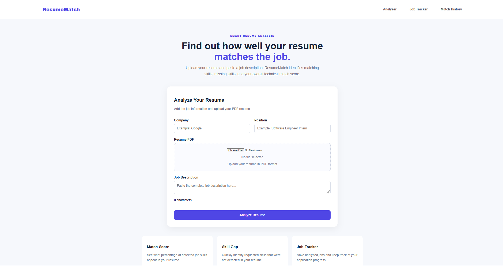
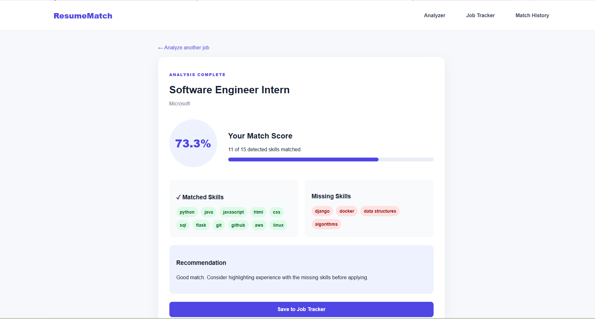
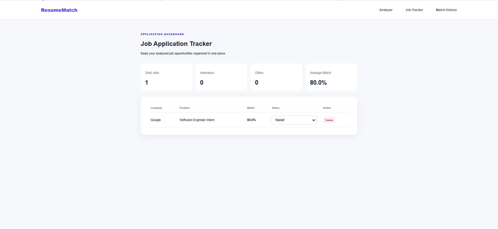
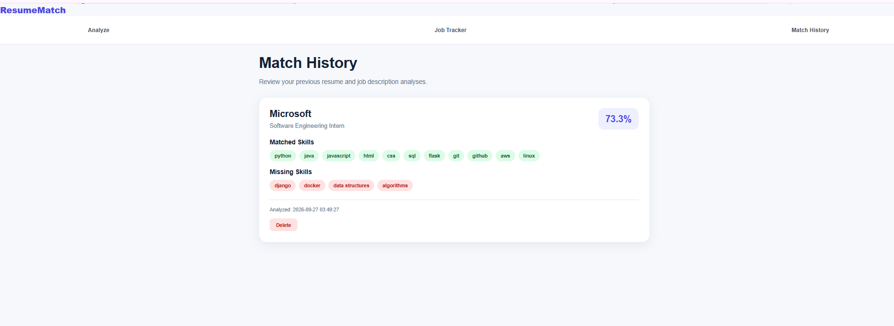

# ResumeMatch

ResumeMatch is a resume analysis application I built to make it easier to compare a resume with a job description. Instead of manually going through a job posting and checking every requirement, the application identifies technical skills and shows how well the resume matches the position.

I built ResumeMatch as both a web application and a Windows desktop application. It also includes a job tracker and match history so users can save opportunities, track their application status, and review previous analyses.

## Screenshots

### Resume Analyzer

Upload a PDF resume, enter the job information, and paste the job description.



### Match Results

ResumeMatch calculates a match score and separates the detected skills into matched and missing skills.



### Job Tracker

Analyzed jobs can be saved to the job tracker, where users can keep track of their application progress.



### Match History

Previous analyses are stored in match history so users can review their results or delete entries they no longer need.



## Features

- Upload a resume in PDF format
- Enter a company name and job position
- Paste and analyze a job description
- Calculate a technical skill match score
- Display matched skills
- Identify skills missing from the resume
- Provide a recommendation based on the match
- Save analyzed jobs to a job tracker
- Update application status
- View job tracker statistics
- Review previous resume analyses
- Delete match history entries
- Run as a web application
- Run as a Windows desktop application

## How It Works

The user uploads a resume and enters information about the job they are interested in. ResumeMatch extracts text from the PDF resume and compares the technical skills found in the resume with skills detected in the job description.

After the comparison, the results page displays a match percentage along with the skills that were found in both the resume and job description. Skills requested by the job description but not detected in the resume are shown separately.

The user can then save the job to the job tracker and review previous analyses through the match history page.

## Technologies Used

- Python
- Flask
- SQLite
- HTML
- CSS
- JavaScript
- PyPDF2
- PyInstaller
- Git
- GitHub

## Web Application

The web version of ResumeMatch runs locally using Flask.

### 1. Clone the repository

```bash
git clone https://github.com/malikaray/ResumeMatch.git
```

### 2. Open the project folder

```bash
cd ResumeMatch
```

### 3. Install the required packages

```bash
pip install -r requirements.txt
```

### 4. Start the application

```bash
python app.py
```

### 5. Open ResumeMatch

Open the following address in your browser:

```text
http://127.0.0.1:5000
```

## Desktop Application

ResumeMatch can also run as a Windows desktop application.

To run the desktop version directly from the source code:

```bash
python desktop.py
```

The desktop version uses the same ResumeMatch functionality while allowing the application to run in its own window.

The project can also be packaged into a Windows executable using PyInstaller.

## Project Structure

```text
ResumeMatch/
│
├── app.py
├── desktop.py
├── matcher.py
├── requirements.txt
├── README.md
│
├── screenshots/
│   ├── analyzer.png
│   ├── results.png
│   ├── tracker.png
│   └── history.png
│
├── static/
│   ├── style.css
│   └── script.js
│
└── templates/
    ├── index.html
    ├── results.html
    ├── tracker.html
    └── history.html
```

## What I Learned

Building ResumeMatch gave me experience working with both the front end and back end of an application. I worked with Flask routes, HTML templates, CSS styling, PDF text extraction, and SQLite for storing application data.

I also learned how different parts of an application work together, how to organize and store user-generated data, how to use Git and GitHub for version control, and how to package a Python project as a Windows desktop application.

## Future Improvements

There are several features I would like to explore as I continue improving the project:

- More advanced skill detection
- Support for additional resume file formats
- More detailed resume recommendations
- Improved job application analytics
- Additional filtering and sorting options for saved jobs
- Deployment of the web version so it can be accessed online

## Author

**Malika Ray**

Computer Science Student  
University of North Texas